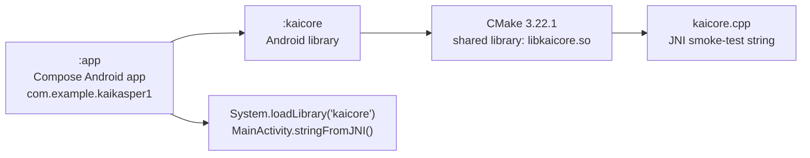
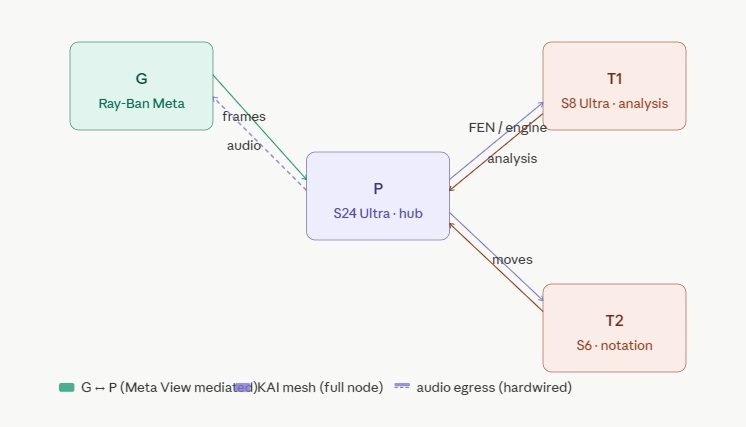
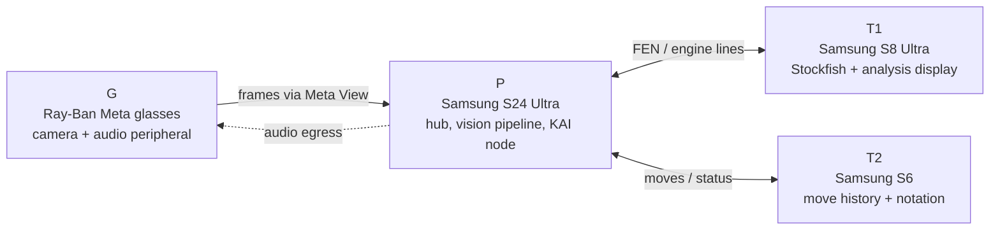
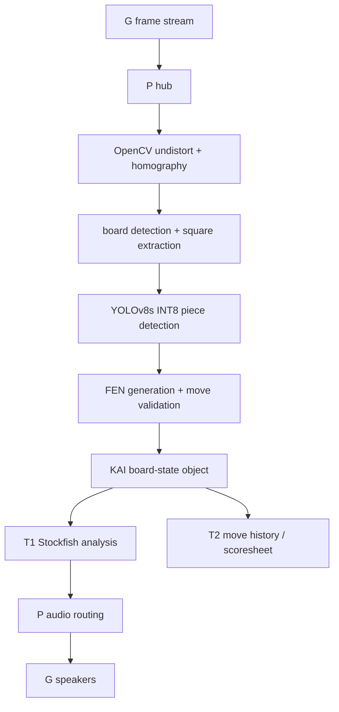

# Kaspar

**KAI Assisted Vision System**

Kaspar is an Android-first workspace for building a distributed chess vision
system on the [KAI](https://github.com/cschladetsch/CppKAI) mesh. The current
repository is the Android foundation: a Jetpack Compose app module plus a
native `kaicore` Android library that proves JNI/CMake packaging.

The longer-term system uses a head-mounted camera to observe a physical chess
board, extract board state as FEN, and distribute analysis across Android
devices. That target architecture is tracked below as roadmap, not current
implementation.

## Current Implementation



- `:app` is the launchable Android app.
- `MainActivity` renders a Compose `Scaffold` containing a text greeting.
- `MainActivity.stringFromJNI()` is the active JNI binding and returns a C++
  smoke-test string from `libkaicore.so`.
- `:kaicore` builds the native shared library with CMake and packages it for
  the app.
- `NativeLib` exists as a library-side placeholder, but its JNI method is not
  currently implemented or used by the app.

## Repository Layout

```
.
|-- app/                  Android application module
|-- kaicore/              Android library module with C++/JNI source
|-- gradle/               Gradle wrapper and version catalog
|-- Resources/            Architecture diagrams and diagram sources
|-- build.gradle.kts      Root Gradle plugin declarations
|-- settings.gradle.kts   Module inclusion and repository policy
`-- Readme.md
```

## Build

Requirements:

- Android Studio with Android Gradle Plugin 9.2.1 support
- Android SDK compile SDK 36, minor API 1
- Android NDK and CMake 3.22.1
- JDK 11-compatible toolchain

Useful commands:

```bash
./gradlew :app:assembleDebug
./gradlew test
./gradlew connectedAndroidTest
```

On Windows:

```bat
gradlew.bat :app:assembleDebug
gradlew.bat test
```

## Implemented Modules

### `:app`

- Namespace and application ID: `com.example.kaikasper1`
- Minimum SDK: 34
- Target SDK: 36
- UI stack: Jetpack Compose, Material 3, Activity Compose
- Depends on `:kaicore`
- Loads `libkaicore.so` directly in `MainActivity`

### `:kaicore`

- Namespace: `com.cschladetsch.kaicore`
- Android library module
- Builds `libkaicore.so` from `kaicore/src/main/cpp/kaicore.cpp`
- Links Android `android` and `log` libraries
- Exposes a placeholder Kotlin `NativeLib` class

## Target Architecture

The intended chess-vision system still follows the P/T/G device split:





G is a peripheral to P. All traffic to and from G is mediated by P through the
Meta View Android integration. G has no KAI node. P is the hub.

T1 and T2 are full KAI nodes. They subscribe to objects published by P and do
not need to know G exists.

## Target Pipeline



## Roadmap

- [x] Android application module
- [x] Android library module
- [x] CMake-built native shared library
- [x] JNI smoke test from Compose UI
- [ ] Move active JNI surface from `MainActivity` into `kaicore.NativeLib`
- [ ] P: KAI node on Android
- [ ] P: Android console demo linked to CppKAI Console
- [ ] P: Meta View frame ingress
- [ ] P: lens calibration
- [ ] P: board detection pipeline
- [ ] P: piece classifier
- [ ] P: FEN generation
- [ ] P: GlassesAgent audio egress
- [ ] T1: KAI node on Android
- [ ] T1: Stockfish integration
- [ ] T1: board visualisation
- [ ] T2: KAI node on Android
- [ ] T2: notation display
- [ ] Mesh: P <-> T1 <-> T2 integration

## Planned Dependencies

The current project only includes AndroidX/Compose dependencies and the Android
NDK/CMake path. The target system is expected to add:

- KAI mesh transport
- OpenCV for Android
- YOLOv8s or equivalent Android inference model
- Stockfish ARM64 binary
- FEN and move-validation library
- Meta View / Media Projection integration

## Diagram Sources

Text sources for the README diagrams are checked in beside the existing JPEG:

- `Resources/current-implementation.mmd`
- `Resources/target-architecture.mmd`
- `Resources/target-pipeline.mmd`

## Demos

- `Demo/AndroidConsole`: Android/NDK console shell intended to consume the
  same CppKAI execution path as `CppKAI/Bin/Console`.

## Name

Named for Kasparov. Garry Kasparov played 1.e4. Kaspar watches you play
whatever you like and thinks about it anyway.
